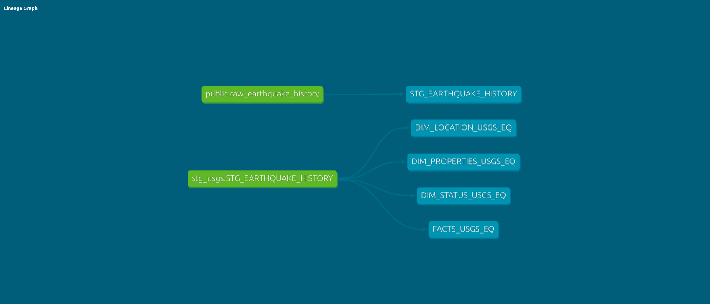

## Data Transformation & Loading Process

The data is ingested into Snowflake via a Spark consumer, which writes to an initial staging table created by the Spark task. The data arrives in Snowflake as JSON rows, which must be parsed into a columnar format to facilitate easier querying and transformations.

### Reason for Using a New Staging Table

To ensure safe debugging without compromising data integrity, a second staging table was introduced. During the development and testing phases of the Kafka and Spark jobs, debugging required multiple iterations, including the deletion of test data. To avoid potential data loss during these tests, the new staging table serves as a temporary, transformed version of the raw JSON data. This approach ensures that the original data remains intact while allowing for effective testing and debugging.

### Purpose of the New Staging Table

Beyond supporting debugging, the new staging table provides an intermediate step for applying transformations that are difficult to perform directly on JSON data. By converting the data into a columnar format early in the pipeline, we ensure that important transformations are not overlooked and that the data is fully prepared for loading into the final schema tables.

### Final Data Processing

Once transformations in the staging table are complete, the cleaned and structured data is moved into the schema tables, where it becomes available for further analysis and reporting.
