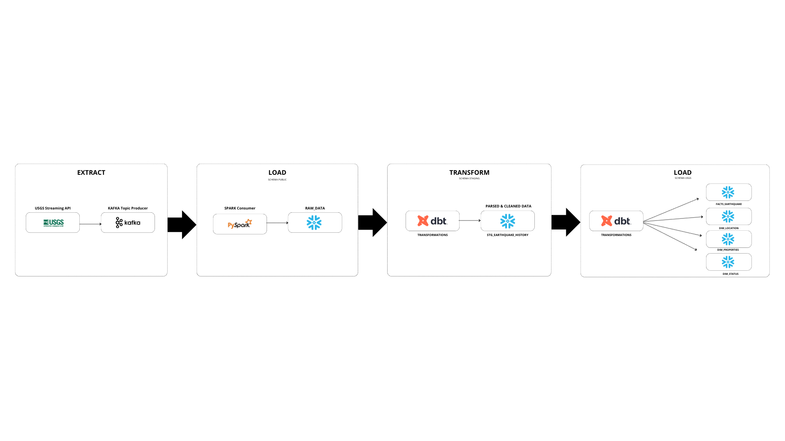

# Kafka-Snowflake Streaming Integration

## ELTL Process for Earthquake Data

This project demonstrates an ELTL (Extract, Load, Transform, and Load) process in the cloud, utilizing data from the USGS Earthquake API to efficiently populate a data warehouse. The pipeline manages the flow from real-time data extraction to structured data storage, making it suitable for analytics and further processing.

## Pipeline Steps:

1. Extract real-time earthquake data from the USGS Earthquake API and Produce it to a Kafka topic.
2. Consume the Kafka data stream using Apache Spark to process the raw data.
3. Load the raw data into a Snowflake staging table via PySpark.
4. Apply transformations to the raw data using dbt.
5. Distribute the transformed data into the appropriate fact and dimension tables in the star schema using dbt.

