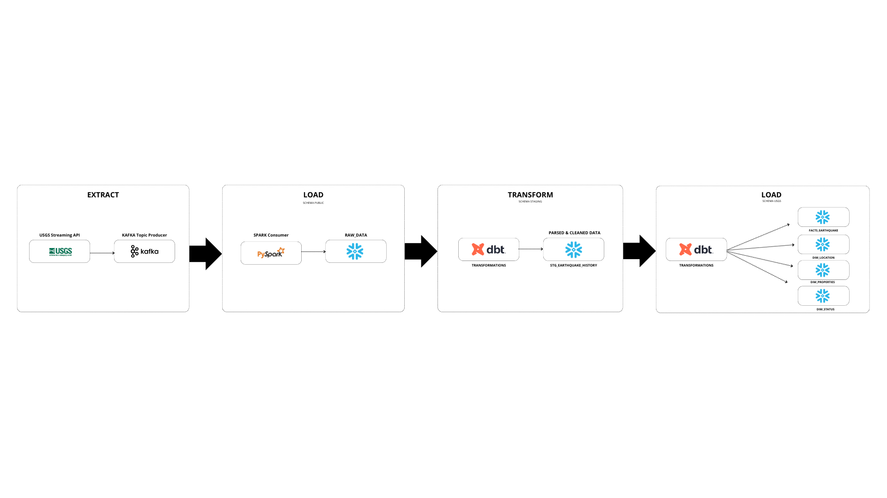

# Kafka-Snowflake Streaming Integration

## ELTL Process for Earthquake Data

This project demonstrates an ELTL (Extract, Load, Transform, and Load) process implemented in the cloud, utilizing data from the USGS Earthquake API to efficiently feed a data warehouse. The pipeline simplifies the entire process from real-time data extraction to structured data storage, making it suitable for analytics and further processing.

## Pipeline Steps:

1. **Extract** data from the USGS Earthquake real-time API and  **Produce** a Kafka topic with the extracted data.
2. **Consume** the Kafka data stream and extract value using Apache Spark.
3. **Load** the transformed data into a Snowflake staging table via PySpark.
4. **Parse and Transform** JSON rows into a structured format in a new staging table, applying necessary transformations and data type casting.
5. Using **Snowflake tasks**, populate fact and dimension tables for the data warehouse.
